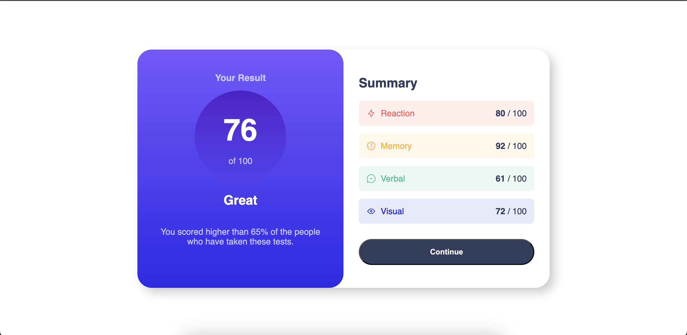
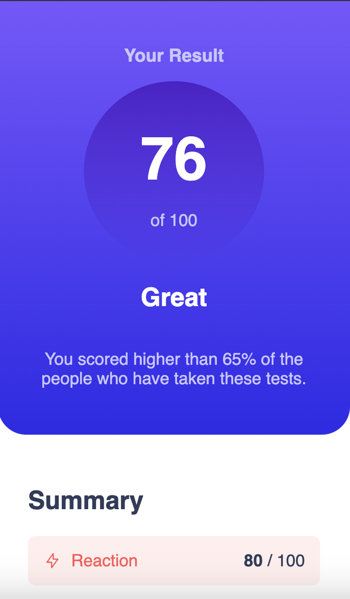
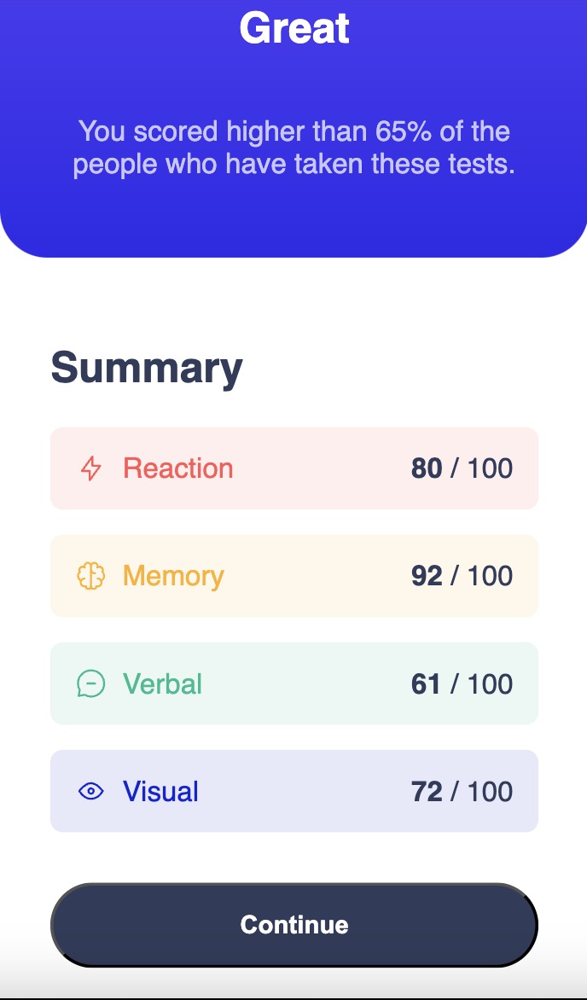

# Frontend Mentor - Results summary component solution

This is a solution to the [Results summary component challenge on Frontend Mentor](https://www.frontendmentor.io/challenges/results-summary-component-CE_K6s0maV). Frontend Mentor challenges help you improve your coding skills by building realistic projects. 

## Table of contents

- [Overview](#overview)
  - [The challenge](#the-challenge)
  - [Screenshot](#screenshot)
  - [Links](#links)
- [My process](#my-process)
  - [What I learned](#what-i-learned)
- [Feedback](#feedback)

**Note: Delete this note and update the table of contents based on what sections you keep.**

## Overview

### The challenge

Users should be able to:

- View the optimal layout for the interface depending on their device's screen size
- See hover and focus states for all interactive elements on the page
- **Bonus**: Use the local JSON data to dynamically populate the content

### Screenshot

**Desktop:**

**Mobile:**

### Links

- Solution URL: [Add solution URL here](https://your-solution-url.com)
- Live Site URL: [Add live site URL here](https://jondoesfrontend.github.io/FEM_Results_Summary/))

## My process
I am trying to only do vanilla HTML/CSS to get a good grasp of the basics. I found this project to be a step up in challenge from the other beginner projects, and struggled to keep the solution neat.

However - this time I tried to build mobile-first, which simplified making it responsive. 

### What I learned
I learned the importance of keeping the html/css clean, and how easy it to create a complete mess of your solution. Next challenge I'll make an effort to refactor along the way. 

## Feedback
I'm quite new to this, and I'd love feedback on how I can improve the project. 
Especially I'm interested in HTML/CSS best practices, and how I could've made the code cleaner. 
